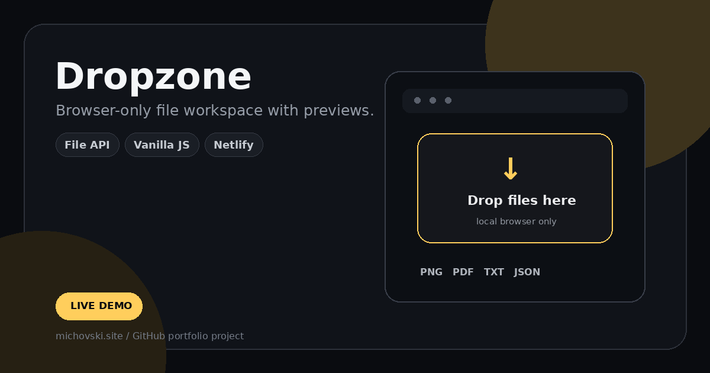

# Dropzone

[](https://dropzone.michovski.site)
[](https://michovski.site)



Browser-only file workspace with previews.

## Live

**https://dropzone.michovski.site**

## Features

- Drag & drop and file picker support
- Image thumbnails
- Text-file previews
- File metadata and size summaries
- Type filters
- Local browser-only processing

## Stack

- HTML5
- CSS3
- Vanilla JavaScript
- Browser File API
- Object URLs

## Run locally

No build step is required.

```bash
git clone https://github.com/michovskiraw/dropzone.git
cd dropzone
```

Then open `index.html`, or use VS Code + Live Server.

## Notes

This is a personal/demo portfolio project.

---

Built by **Michał Ciechanowski** · [michovski.site](https://michovski.site)
